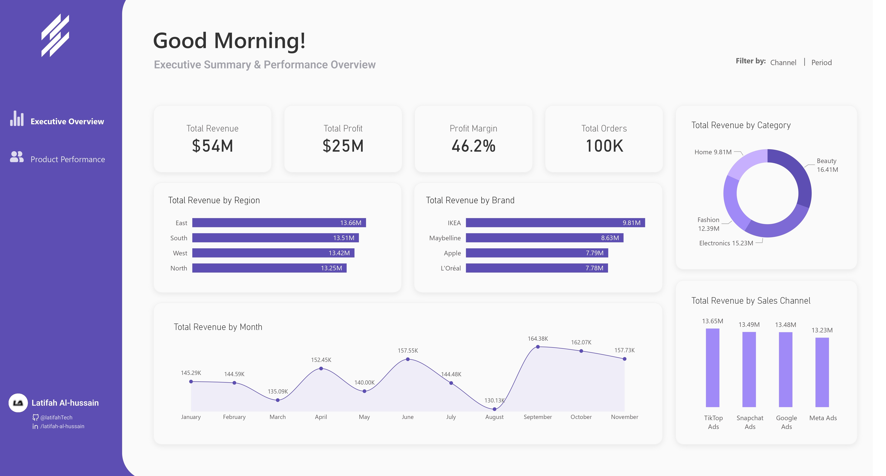
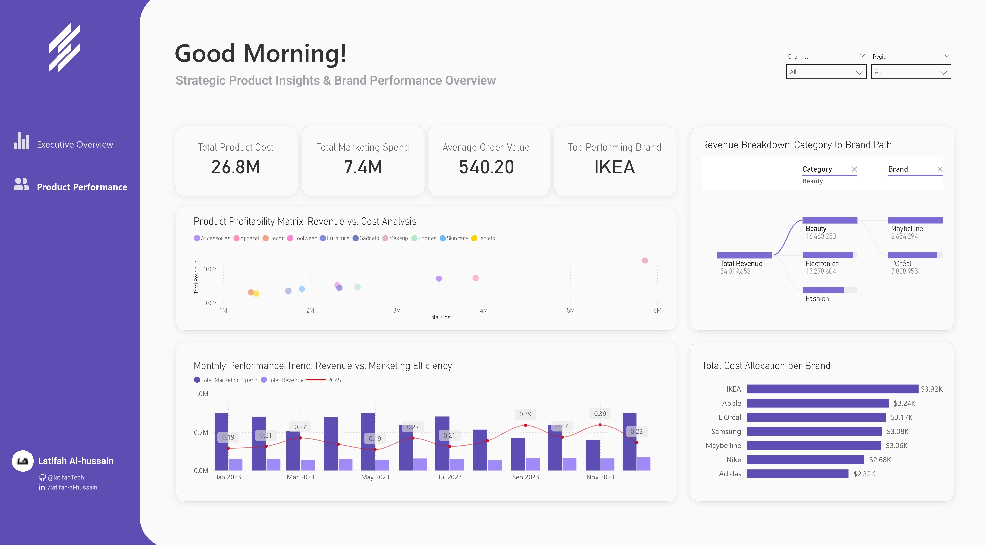

# 📊 E-commerce Sales & Product Performance Dashboard

## 📝 Overview
This project is a data-driven solution designed to bridge the gap between Raw E-commerce Data and Strategic Business Decisions. By analyzing a complex dataset of sales, marketing, and product performance, this dashboard identifies growth opportunities and operational bottlenecks.

---

## 🚀 Live Preview & Design

---

## 🎯 Key Insights & Pages

### 1. Executive Overview (Global Performance)
The first layer of analysis is dedicated to high-level decision-makers.
* **Core KPIs:** Monitoring **Total Revenue ($54M)**, **Total Profit ($25M)**, and a healthy **Profit Margin (46.2%)**.
* **Revenue Segmentation:** Breakdown by Region (East, South, West, North) and Top Brands (IKEA, Maybelline, Apple, L'Oreal).
* **Sales Channels:** Comparative analysis of performance across social and search platforms (TikTok, Snapchat, Google, Meta Ads).
* **Monthly Trends:** Visualizing sales fluctuations to identify seasonal peaks.

### 2. Strategic Product Insights (Deep-Dive Analysis)
The second layer focuses on operational efficiency and product-level data.
* **Marketing Efficiency:** Tracking **Total Marketing Spend ($7.4M)** against **Average Order Value ($540.20)**.
* **Profitability Matrix:** A Scatter Chart analyzing the relationship between Total Cost and Total Revenue per category.
* **Decomposition Tree:** An interactive root-cause analysis tool to break down revenue from Category to Brand level.
* **Brand Allocation:** Detailed cost distribution across major partners.

---

## 🛠️ Technical Stack & Implementation

* **Power BI:** Data visualization, DAX calculations, and interactive filtering.
* **Power Query (ETL):** Data cleaning, transformation, and shaping of the e-commerce dataset.
* **Figma:** Custom UI design, including the Side Navigation Bar and specialized Background Layouts.
* **Data Modeling:** Implemented a **Star Schema** to ensure fast query performance and scalable reporting.

---

## 📂 Project Structure
* `Sale Analysis Dashboard.pbix`: The main Power BI report file.
* `Data/`: Folder containing the (Mock) datasets used for the analysis.
* `Screenshots/`: High-resolution images of the dashboard pages.

---

## 👩‍💻 About the Developer
**Latifah Al-Hussain | [LinkedIn](https://linkedin.com/in/latifah-al-hussain)**
> Information Technology Graduate | Full-Stack Developer | Data Analyst  

---
If you find this project helpful, feel free to ⭐ the repository!
